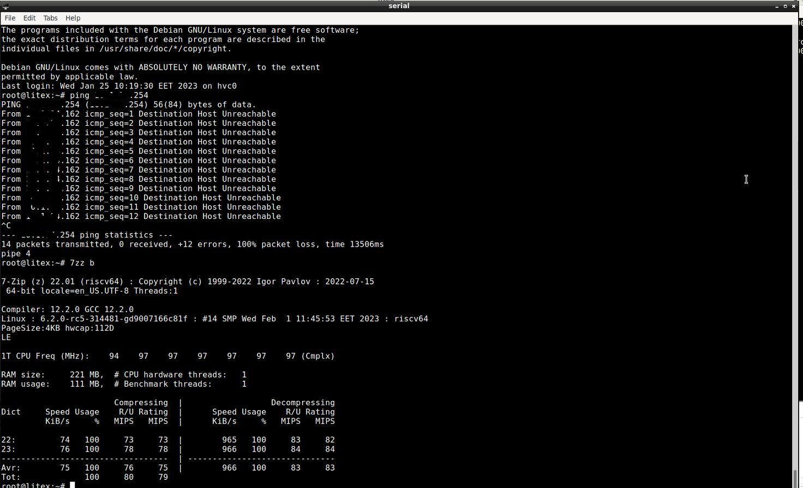
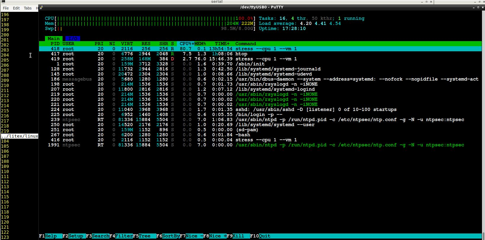

# qmtech_wukong_debian_on_litex_naxriscv
Running RISCV64 Debian on Litex/NaxRiscv with a qmtech wukong FPGA 

Inspired from https://spinalhdl.github.io/NaxRiscv-Rtd/main/index.html, with a lot of advices (and many thanks) from Charles Papon.

I managed to run a stable RISCV64 Debian with Qmtech's Wukong board (version 2), with xc7a100t, and Litex/NaxRiscv.

As a development environment I used Debian 11 "bullseye" with backports. The steps I followed are (beware, YMMV) :

1) I Installed Litex https://github.com/enjoy-digital/litex as usual.
2) I used my proved  GCC cross-compiler toolchain for 64-bit RISC-V, the steps are from Litex/Rocket's Readme:

```
	git clone --recursive https://github.com/riscv/riscv-gnu-toolchain
	pushd riscv-gnu-toolchain
	./configure --prefix=$HOME/RISCV --enable-multilib
	make newlib linux
	popd
```	
**DO NOT SKIP** this step if you do not have an ***already proved toolchain***, especially for OpenSBI. It may take some time to build, but you will not regret it ! Put the toolchain in your $PATH and confirm that eg riscv64-unknown-linux-gnu-gcc runs ok. *2023-02-10 Recently I found that I can also use Debian's toolchain from riscv-sid , at least from the kernel and then - not tested yet for opensbi and/or litex.*

3) I run the following to build a FPGA Bitstream: 

```	
   litex-boards/litex_boards/targets/qmtech_wukong.py --build  --with-sdcard  --with-ethernet \
	--with-video-terminal --cpu-type naxriscv  --sys-clk-freq 100e6 --board-version 2  \
	--csr-csv  qmtech_wukong.csv  --csr-json qmtech_wukong.json \
	--l2-size 0  --xlen 64 --scala-args 'rvc=true,rvf=true,rvd=true,mmu=true' \
	--uart-baudrate 3000000    > qmtech_wukong.log 2>&1 &

```	

Note the three generated files: .csv , .json and .log, will be used in the next step. 
Also note that you can use 3MBps on the uart for this board (litex_term or putty).


4) With the recent commits it is very easy to create the DTS file, just run :

    litex_json2dts_linux --root-device mmcblk0p3 qmtech_wukong.json > qmtech_wukong.dts
		
5) Edit your DTS (I have uploaded mine to compare). I used : 
```	
      bootargs = "console=hvc0  earlycon=sbi swiotlb=noforce root=/dev/mmcblk0p3 rw rootwait ";
      linux,initrd-start = <0x42000000>;
      linux,initrd-end   = <0x43000000>;
```	

The reason for sbi/hvc0 (after Charles' suggestion) is that liteuart gives me a lot of headaches, but the hvc driver works.

Also these
```
  riscv,isa = "rv64imafdc";

In memory I changed 

  reg = <0x41000000 0xF000000>;

and didn't used the reserved-memory block.
```		
Finally compile your DTB:

```		
	dtc -O dtb -o qmtech_wukong.dtb qmtech_wukong.dts
```	
6) Compile opensbi (I used the one from litex, feel free to use any clone that suits you) : 

```
		git clone https://github.com/litex-hub/opensbi
		cd opensbi
		git checkout 0.8-linux-on-litex-vexriscv
		cd platform/litex
		cp -avf vexriscv naxriscv_64
		cd naxriscv_64
```		
Edit the files in this directory, or use mine from opensbi.tgz
```		
		cd ../..
		make PLATFORM=litex/naxriscv_64 CROSS_COMPILE=riscv64-unknown-linux-gnu- -j$(nproc)
```		
Your opensbi.bin is build/platform/litex/naxriscv_64/firmware/fw_jump.bin 
		
		
7) Compile Linux kernel :

```
	git clone https://github.com/litex-hub/linux.git
	cd linux
	git checkout litex-rebase
	make ARCH=riscv CROSS_COMPILE=riscv64-unknown-linux-gnu- litex_rocket_defconfig 
	
```	

You should edit .config to add a few things, eg
	
```
	CONFIG_RISCV_SBI=y
	CONFIG_RISCV_SBI_V01=y
	CONFIG_SERIAL_EARLYCON_RISCV_SBI=y
	CONFIG_HVC_RISCV_SBI=y
```
To be sure, use my .config (currently from 6.3.0-rc1-gebf779db3895).  Then run:
	
```	
	make ARCH=riscv CROSS_COMPILE=riscv64-unknown-linux-gnu- -j$(nproc)

```

Your kernel Image will be in 	arch/riscv/boot/Image
	
	
8)  My target is to boot from an sdcard a full Debian environment. I created a chroot Debian environment with the instructions from https://wiki.debian.org/RISC-V, step 6, "Creating a riscv64 chroot", with debootstrap. 
```
	sudo apt-get install debootstrap qemu-user-static binfmt-support debian-ports-archive-keyring
	sudo debootstrap --arch=riscv64 --keyring /usr/share/keyrings/debian-ports-archive-keyring.gpg \
      --include=debian-ports-archive-keyring unstable /tmp/riscv64-chroot http://deb.debian.org/debian-ports
```

and run after the steps in "Preparing the chroot for use in a virtual machine". The steps for u-boot are not really needed (for the moment at least). I modified a few other things in the chroot environment, 
eg  installed udev, locales / timezone and a few others. The usual things needed to be edited, eg hostname, hosts, network/interfaces, fstab etc. BEWARE with fstab, certainly you will have to adjust based on the UIDS  that your sdcard has.

In systemd's journald.conf, I used:
```
	Storage=none
```
and in logind.conf:
```
	NAutoVTs=0
	ReserveVT=0
```

and in /etc/login.defs :
```
	LOGIN_TIMEOUT           180
```

After all, this is a very low resources board and it is SLOW!    


9)  I used a Debian style initrd. Initrd is a usefull to initialize devices during boot, fsck the filesystems etc. 	In order to make one, I used a trick: 
	I moved my linux source tree inside /usr/src/ of my riscv Debian chroot filesystem, run  chroot on the root of the filesystem, erased all scipts in the kernel tree (they have been compiled as x86 binaries) and recompiled the kernel natively with Debian's gcc, and	then run make install - ie I installed the kernel inside my riscv filesystem. Debian's scripts made the initrd for me. Lazy, I know, if you know how to properly use mkinitrd feel free to use it instead.
	If unsure how to do any of these, use mine.


10) Created a boot.json that contains :

```
	{
        "Image"                  :       "0x41000000",
        "qmtech_wukong.dtb"      :       "0x46000000",
        "initrd.img"   		 :       "0x42000000",
        "opensbi.bin"            :       "0x40f00000"
	}

```

11) Prepared a switable sdcard with three partitions: 1st is VFAT that contains the above boot.json and all the other files used by it. 2nd partition is a swap. 3rd partition is ext4 and should contain a copy of the chroot riscv Debian filesystem.
Ensure that fstab is correct accordingly to the card ! 


Put the card in the board, program the bitstream with Vivado, and you are ready to boot to Debian !


Note: I found that a small heatsink improves FPG'a stability. Also placing the board inside the computer room (18 Celsious) helped a lot ;)

2023-02-08: I have some issues with the ethernet. Sometimes it seems to be ok, the system has initialized it and there are leds flashing and IP address and interrupt is correct, no errors, a lot of dropped, and either I can not ping the external world, or I can ping but can't really pass traffic over it. This is happening also with Litex/Rocket. In the past I had Rocket running with network without a problem. Not sure where is the issue, maybe a change in liteeth, some trouble with board interrupts, or maybe the ethernet on my board has became defected (I have checked cables, switches etc). 





